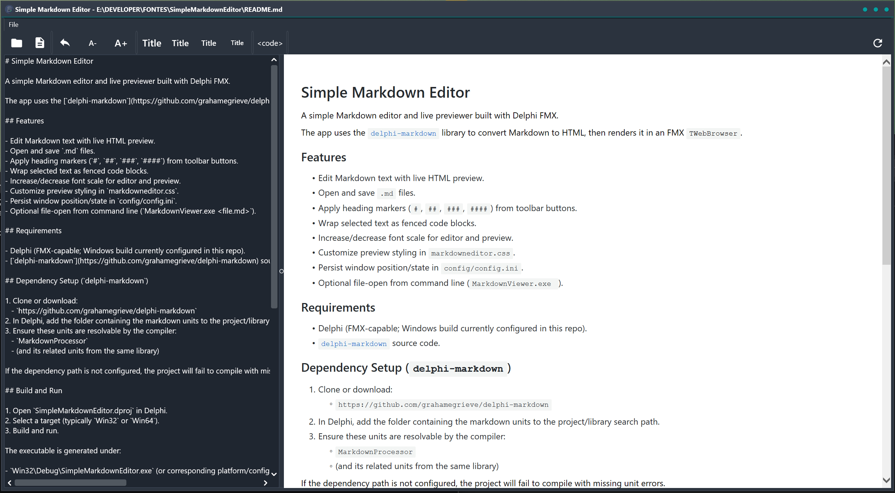

# Simple Markdown Editor

A simple Markdown editor and live previewer built with Delphi FMX.

The app uses the [`delphi-markdown`](https://github.com/grahamegrieve/delphi-markdown) library to convert Markdown to HTML, then renders it in an FMX `TWebBrowser`.

## Features

 

- Edit Markdown text with live HTML preview.
- Open and save `.md` files.
- Apply heading markers (`#`, `##`, `###`, `####`) from toolbar buttons.
- Wrap selected text as fenced code blocks.
- Increase/decrease font scale for editor and preview.
- Customize preview styling in `markdowneditor.css`.
- Persist window position/state in `config/config.ini`.
- Optional file-open from command line (`MarkdownViewer.exe <file.md>`).

## Requirements

- Delphi (FMX-capable; Windows build currently configured in this repo).
- [`delphi-markdown`](https://github.com/grahamegrieve/delphi-markdown) source code.

## Dependency Setup (`delphi-markdown`)

1. Clone or download:
   - `https://github.com/grahamegrieve/delphi-markdown`
2. In Delphi, add the folder containing the markdown units to the project/library search path.
3. Ensure these units are resolvable by the compiler:
   - `MarkdownProcessor`
   - (and its related units from the same library)

If the dependency path is not configured, the project will fail to compile with missing unit errors.

## Build and Run

1. Open `SimpleMarkdownEditor.dproj` in Delphi.
2. Select a target (typically `Win32` or `Win64`).
3. Build and run.

The executable is generated under:

- `Win32\Debug\SimpleMarkdownEditor.exe` (or corresponding platform/configuration path)

## Usage

- `Open`: load a Markdown file.
- `Save`: save current text to `.md`.
- `Refresh`: regenerate preview.
- `A+/A-`: adjust font scale.
- `Title`: apply heading levels.
- `Code`: wrap selected text with triple backticks.

## Styling

Preview styles are in:

- `SimpleMarkdownEditor.css`

The application injects runtime values (such as background color and body font scale) into this CSS via `LoadCSS` in:

- `SimpleMarkdownEditor.gui.pas`

## Project Files

- `SimpleMarkdownEditor.dpr`: application entry point.
- `SimpleMarkdownEditor.dproj`: Delphi project configuration.
- `SimpleMarkdownEditor.gui.pas`: main form logic, Markdown processing, preview refresh.
- `SimpleMarkdownEditor.gui.fmx`: form/UI layout.
- `SimpleMarkdownEditor.css`: HTML preview theme.

## Latest fixes
### 2026-02-17
- Almost **instant refresh** updates for the HTML preview
- Reverted from mdDaringFireball dialect to mdCommonMark due some formatting issues.
- Fixed issue when loading a markdown that contains images
- More minor fixes
- Added Bold, Italic and Strike through text formatting
### 2026-02-16
- Added confirmation to save file if changes were made
- Once editing a page the html preview should scroll to the last changed position, this is a ugly way to try sync editing with preview
- Reduced the refresh timeout from 5 to 3 seconds
- Changed markdown dialect to mdDaringFireball which handles better the malformed markdown texts
- Change application icon
- Other minor behavior changes
